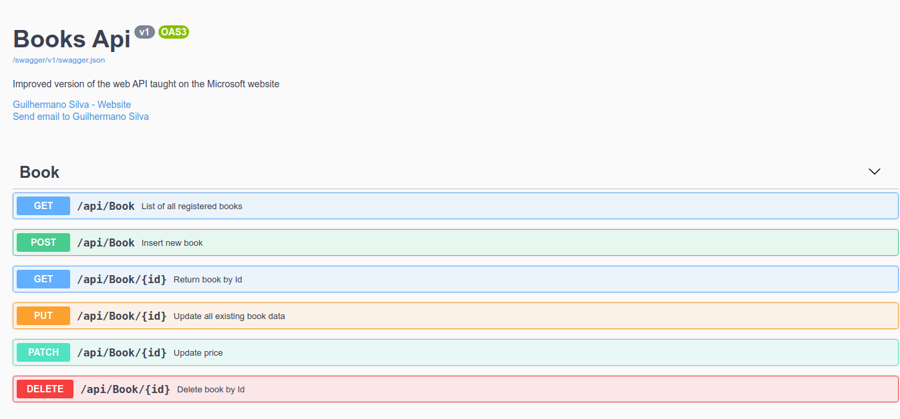

# API de cadastro de livros

       

Api de cadastro de livros desenvolvida com ASP.NET Core 5.0 e MongoDb Atlas.

## Motivação
Lendo a página da [documentação](https://docs.microsoft.com/en-us/aspnet/core/tutorials/first-mongo-app?view=aspnetcore-5.0&tabs=visual-studio) oficial da Microsoft sobre o desenvolvimento de uma API com ASP.NET e MongoDB eu desenvolvi a base desse projeto, mas pensei que poderia melhorá-la e inserir alguns padrões de projetos assim como deixar um pouco mais completa.

## Foi adicionado ao projeto:
 * Camada de Entidades;
 * Mais campos no modelo de entidade *Book* para deixá-lo mais completo de informações;
 * Modelo de entidade de inserção de dados base para a criação de um novo livro;
 * Mapeamento do modelo de entrada para o modelo de dados; 
 * Inteface para a camada de serviços;
 * Separação da interface de configuração do mongo;
 * Padrão **Repository** com interface e implementação para desacoplar da **Service**;
 * Novo endpoint *HttpPach* para atualizar apenas o preço do produto;
 * Comentários do swagger para melhorar a documentação para quem for consumir a API;
 * Códigos http de retorno dos *Endpoints*;

